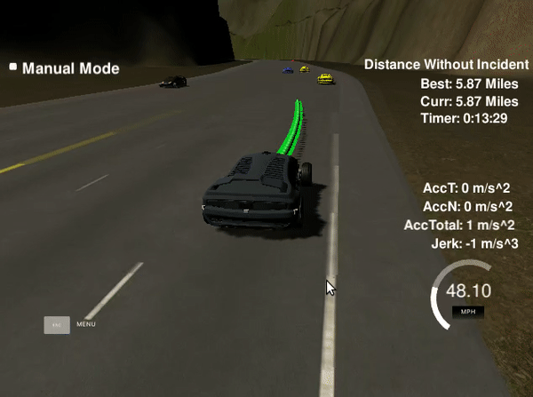

# CarND-Path-Planning-Project

### Introduction

In this project, the goal is to safely navigate around a virtual highway with other traffic that is driving +-10 MPH of the 50 MPH speed limit. The car's localization, sensor fusion data and a sparse map list of waypoints around the highway were provided. Rules are that the car should not hitting others cars as well as driving inside the marked lanes unless changing lanes. Moreover, the car should not violate some motion constraints such as maximum velocity, maximum acceleration and maximum jerk. The speed limit is 50 MPH, and the car should try to drive as close as possible to the speed limit but not exceed it. One complete loop for the track is 6945.554 meters. The acceleration limit is 10 m/s^2 and the jerk limit is 10 m/s^3.

#### The map of the highway is in data/highway_map.txt
Each waypoint in the list contains  [x,y,s,dx,dy] values. x and y are the waypoint's map coordinate position, the s value is the distance along the road to get to that waypoint in meters, the dx and dy values define the unit normal vector pointing outward of the highway loop.

The highway's waypoints loop around so the frenet s value, distance along the road, goes from 0 to 6945.554.

#### Main car's localization Data (No Noise)

["x"] The car's x position in map coordinates

["y"] The car's y position in map coordinates

["s"] The car's s position in frenet coordinates

["d"] The car's d position in frenet coordinates

["yaw"] The car's yaw angle in the map

["speed"] The car's speed in MPH

#### Previous path data given to the Planner

//Note: Return the previous list but with processed points removed, can be a nice tool to show how far along
the path has processed since last time. 

["previous_path_x"] The previous list of x points previously given to the simulator

["previous_path_y"] The previous list of y points previously given to the simulator

#### Previous path's end s and d values 

["end_path_s"] The previous list's last point's frenet s value

["end_path_d"] The previous list's last point's frenet d value

#### Sensor Fusion Data, a list of all other car's attributes on the same side of the road. (No Noise)

["sensor_fusion"] A 2d vector of cars and then that car's [car's unique ID, car's x position in map coordinates, car's y position in map coordinates, car's x velocity in m/s, car's y velocity in m/s, car's s position in frenet coordinates, car's d position in frenet coordinates. 

### Implementation

Implementation of this task is summarized as the following six steps.

1. Get interpolated waypoints of nearby track
2. Determine ego car's initial state to start a new path
3. Predict other nearby cars' states from sensor fusion
4. Generate possible target for ego car
5. Construct best trajectory due to lowest cost
6. Get ego car's future new path

#### (1) Get interpolated waypoints of nearby track

Since the waypoints provided in `highway_map.csv` are to sparse -- about 30 meters apart -- to determine a accurate localization of ego car, so we have to produce a dense waypoints of ego car's nearby track. Currently, the set of interpolated waypoints start from 5 coarse waypoints behind and end at 10 coarse waypoints forward. Each of these interpolated waypoints are put 0.5 m apart.

#### (2) Determine ego car's initial state to start a new path

Ego car's initial state for starting a new path includes [`x`, `y`, `angle`, `s`, `s_d`, `s_dd`, `d`, `d_d`, `d_dd`]. In order to generate a smooth path and handle the transmission latency, points in previous path were used.  A trick to determine   velocity and acceleration along `s ` and `d` direction is to first calculate the velocity and acceleration in `x` and `y` direction. Then the velocity and acceleration were projected into `s` and `d` direction. Directly calculating `s_d`  with  `s_d = (pos_s - pos_s2)/PATH_DT` is erroneous since the direction of `s` is constantly changing.

#### (3) Predict other nearby cars' states from sensor fusion

The received sensor fusion data is parsed and predicted trajectories for other nearby cars are generated. The generated predictions of other cars matched the duration and interval of ego car's generated trajectory. In order to generate the predictions, an assumption that other cars drive in constant speed was made.

#### (4) Generate possible targets for ego car

With predictions of other nearby cars, possible states for ego car were generated.  There are three possible states, "KL" (keep lane), "LCL" (lane change left) and "LCR" (lane change right). Then possible targets were generated due to these states. Each target was given in a Frenet coordinate.

#### (5) Construct best trajectory due to lowest cost

For each given target, a quintic polynomial, jerk-minimizing trajectory was produced. Then each trajectory was evaluated according to a set of cost functions. The best trajectory was chosen with a lowest cost. Currently, the cost functions  include:

* Collision cost : it penalizes trajectory that collides with other cars.
* Nearby cost : it penalizes trajectory that comes too close to other cars
* Efficiency cost :  it penalizes trajectory that has a lower target velocity

#### (6) Get ego car's future new path

In order to get a smooth new path, a certain number of points from previous path were used. A spline then started with the last two points of the previous path, and ended with two points 20 and 40 meters ahead and in the target lane. The velocity was only allowed increment or decrement by a small amount to prevent excessive acceleration and jerk. The corresponding `next_x_vals` and `next_y_vals` were calculated along the interpolated x and y splines. 

### Result

The result can be seen in `output.mp4`. 